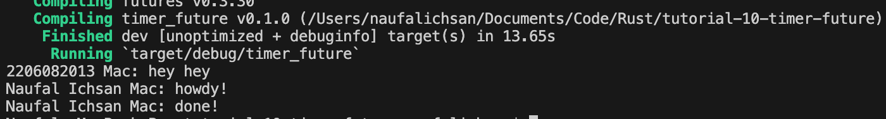
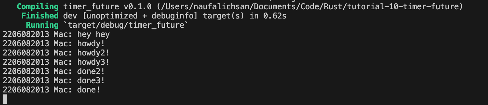

# Tutorial-10
---
#### Nama: Naufal Ichsan
#### NPM: 2206082013
#### Kelas: Adpro A
---
### Refleksi

Dari hasil pengamatan, dapat dilihat bahwa fungsi async akan dijalankan di luar fungsi utama yang menjalankannya. Oleh karena itu, "hey hey" bisa saja dieksekusi lebih dulu sebelum "howdy!" dan "done!" karena "hey hey" berada di luar fungsi async yang akan melanjutkan program dan menjalankan ```println!("hey hey");``` saat fungsi async masih menunggu hasil dari future.


Dari hasil output yang dihasilkan, terlihat bahwa keberadaan banyak spawner menyebabkan lebih banyak task yang dilakukan karena lebih banyak task yang di-queue ke dalam pengirim task yang bertindak seperti antrian pesan. Tidak menjatuhkan spawner menyebabkan program tidak pernah berhenti karena program mengasumsikan bahwa akan ada transmisi data oleh spawner. drop(spawner) sendiri merupakan indikasi bahwa interaksi sudah selesai dan spawner akan ditutup. Ketika sebuah spawner memanggil fungsi spawn, akan dibuat sebuah task baru yang dikirimkan ke pengirim task. Eksekutor akan mengambil satu task dari pengirim task dan menjalankannya, kemudian mengambil task lainnya sampai task habis dan spawner di-drop yang menandakan interaksi sudah selesai.

